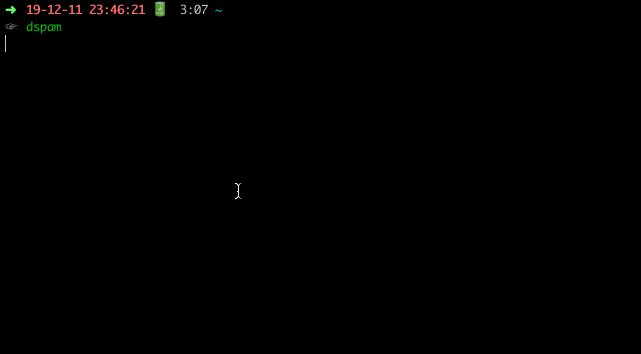

# Automate Deletion of Spam Emails

- The purpose of this app is to automate the deletion of all spam emails.
- The downside of this is that no AI is implemented, therefore, spam emails are not automatically detected.
- This means that manually updating of spam_list.txt is required.

## Tests

- Tested on Mac OSX Mojave.
  - linux should work, but yet to be tested.
- Python 3.6 and above should work.

## How to get it to work?

- Python needs to be installed.
- tqdm modules need to be installed for the progress bar to work.
  > pip install tqdm
- Default mode: all files are created, opened, and saved automatically

  - If app is cloned, no files will be created. Thus, filling of sensitive information (email, password) and editing of spam_list.txt is required.
  - If the required text files are not included, it will automatically be created and you will be prompted to fill in the required information.
  - To run
    > python run.py

- Manual mode: manually create all files.

  - All files created and the values stored will be saved at the path keyed during prompt.
  - However, these files and paths have to be added to the useDefault method in the fileLib.py located in the libraries folder.
  - Any further changes, please refer to the docs written in the .py files for the required location to update.
  - To run
    > python run.py manual

- Help mode: display help menu if you have forgotten the simple commands.
  - To run
    > python run.py help
